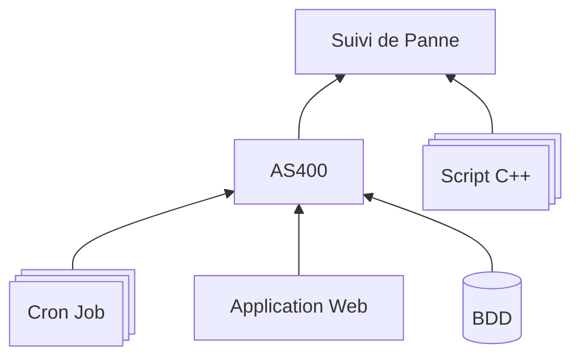
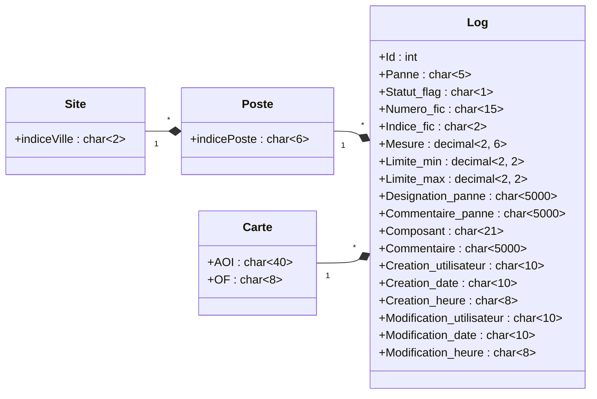

```insta-toc
---
title:
  name: Sommaire
  level: 1
  center: false
exclude: ""
style:
  listType: dash
omit: []
levels:
  min: 1
  max: 6
---

# Sommaire

- Présentation du Projet
    - [[README]]
    - Objectifs
    - Technologies utilisées
    - Structure du Projet
- Le Script C++
    - Formater
        - [[docTechniqueXml|librairie]]
        - Scrapping des tickets
        - Formatage XML
            - logique xml
        - Résultat
    - Transfert SFTP
        - [[docTechniqueSFTP|librairie]]
        - vcpkg
        - .env
- BDD / Cron Job
    - BDD
        - Création table
        - Diagramme de Relation
    - Cron Job
        - Récupération du fichier
        - Transfert à la base de données
- AS400 / Webix
    - AS400
    - Webix
        - Filtre
        - Affichage Test Precedent
```

# Présentation du Projet
---
> [!summary] Résumer
> Le projet **Suivi de Pannes** vise à optimiser l'analyse des pannes au dépannage des cartes. Grâce à une interface web intuitive et des outils d'analyse avancés, les dépanneurs peuvent mieux identifier les récurrences et améliorer le bon du premier coup.

[](diagrams_code#^diagram-usecase)
## [[README]]


## Objectifs
- Améliorer la lecture des pannes grâce à un tableau filtrable et des graphiques interactifs.
- Réduire la récurrence des pannes en facilitant l’analyse des tendances.
- Augmenter l’efficacité des interventions avec un meilleur diagnostic.
- Étendre l'outil sur l'ensemble des sites de production
  

## Technologies utilisées

 - **QT Creator**  [ IDE ]
	 - C++ 
	 - XML     [ librairie interne Qt ]
		 - QTXml 
		 - QXmlStreamWriter
	- FTP      [ librairie open source ]
		- CURL
		- OpenSSl
		- libshh2
	- vcpkg    [ gestionnaire de librairie ]
- **IBM Db2**     [ BDD ]
- **Webix**       [ Dashboard ]

## Structure du Projet



# Le Script C++
- - -
*main.cpp*
![[main-carbon.png]]
## Formater
> [!summary] Résumer
> **Le script** doit modifier la donnée source 
> ( ticket de dépannage .txt produit par chacun des postes de test) 
> pour ne récupérer que les infos essentiels et les codes liés à la carte et rassembler ces dernières dans un fichier xml journalier.

[](diagrams_code#^diagram-sequence-scriptcpp)
### [[doc_Technique#Xml|librairie]]
- QXmlStreamWriter
- QtXml/QDomDocument
- QTextStream

### Scrapping des tickets
*recherche_fichier.cpp*
![[rf_start()-carbon.png]]
![[scrap-recup_infoCarte()-carbon.png]]
### Formatage XML
  format:
	- [ dateHeure ]YYYY-MM-DD hh::mm::ss
	- AOI
	- statutFlag
		- 1 Vert Résolu
		- 0 Rouge À dépanner
		- 2 Orange Dépanner mais pas repasser
		- 3 Bleu Résolu mais sans dépannage
#### logique xml
> [!note]
> Pour correctement lire un fichier xml avec **QDomDocument**, une balise mère contenant les différentes éléments est nécessaire, sauf que la librairie ne dispose pas d'un moyen de correctement insérer un element dans un autre tout en gardant un aspect lisible pour l'humain. Donc j'ai du coder la logique pour.

*recherche_fichier.cpp*
![[recup_infoCarte()-carbon.png]]
```cpp
void Recherche_Fichier::newLog(QXmlStreamWriter &Nouveau_texte, QString dateHeure, QString AOI, QString Article, QString of, QString fic, QString iFIC, QString panne, QString designationPanne, QString mesure, QString limitMin, QString limitMax, QString commentairePanne, QString composant, QString stateFlag, QString commentaire, QString poste, QString site, QString testPrecedent) {
    Nouveau_texte.writeStartElement("Log");
    Nouveau_texte.writeStartElement("dateHeure");
    Nouveau_texte.writeCharacters(dateHeure.toUtf8());
    Nouveau_texte.writeEndElement();

    Nouveau_texte.writeStartElement("AOI");
    Nouveau_texte.writeCharacters(AOI.toUtf8());
    Nouveau_texte.writeEndElement();

    Nouveau_texte.writeStartElement("Article");
    Nouveau_texte.writeCharacters(Article.toUtf8());
    Nouveau_texte.writeEndElement();

    Nouveau_texte.writeStartElement("OF");
    Nouveau_texte.writeCharacters(of.toUtf8());
    Nouveau_texte.writeEndElement();

    Nouveau_texte.writeStartElement("FIC");
    Nouveau_texte.writeCharacters(fic.toUtf8());
    Nouveau_texte.writeEndElement();

    Nouveau_texte.writeStartElement("iFIC");
    Nouveau_texte.writeCharacters(iFIC.toUtf8());
    Nouveau_texte.writeEndElement();

    Nouveau_texte.writeStartElement("panne");
    Nouveau_texte.writeCharacters(panne.toUtf8());
    Nouveau_texte.writeEndElement();

    Nouveau_texte.writeStartElement("designationPanne");
    Nouveau_texte.writeCharacters(designationPanne.toUtf8());
    Nouveau_texte.writeEndElement();

    Nouveau_texte.writeStartElement("mesure");
    Nouveau_texte.writeCharacters(mesure.toUtf8());
    Nouveau_texte.writeEndElement();

    Nouveau_texte.writeStartElement("limiteMin");
    Nouveau_texte.writeCharacters(limitMin.toUtf8());
    Nouveau_texte.writeEndElement();

    Nouveau_texte.writeStartElement("limiteMax");
    Nouveau_texte.writeCharacters(limitMax.toUtf8());
    Nouveau_texte.writeEndElement();

    Nouveau_texte.writeStartElement("commentaire");
    Nouveau_texte.writeCharacters(commentaire.toUtf8());
    Nouveau_texte.writeEndElement();

    Nouveau_texte.writeStartElement("poste");
    Nouveau_texte.writeCharacters(poste.toUtf8());
    Nouveau_texte.writeEndElement();

    Nouveau_texte.writeStartElement("site");
    Nouveau_texte.writeCharacters(site.toUtf8());
    Nouveau_texte.writeEndElement();

    Nouveau_texte.writeStartElement("commentairePanne");
    Nouveau_texte.writeCharacters(commentairePanne.toUtf8());
    Nouveau_texte.writeEndElement();

    Nouveau_texte.writeStartElement("composant");
    Nouveau_texte.writeCharacters(composant.toUtf8());
    Nouveau_texte.writeEndElement();

    Nouveau_texte.writeStartElement("stateFlag");
    Nouveau_texte.writeCharacters(stateFlag.toUtf8());
    Nouveau_texte.writeEndElement();

    Nouveau_texte.writeStartElement("testPrecedent");
    Nouveau_texte.writeCharacters(testPrecedent.toUtf8());
    Nouveau_texte.writeEndElement();
    Nouveau_texte.writeEndElement();
}
```
### Résultat
*exemple de log...*
```xml
<?xml version="1.0" encoding="UTF-8"?>

<Logs>
    <Log>
        <dateHeure>01/07/2024 07:41:15</dateHeure>
        <AOI>31420FW</AOI>
        <Article>693608E00</Article>
        <OF>01049040</OF>
        <FIC>FIC592655</FIC>
        <iFIC>9</iFIC>
        <panne>0</panne>
        <designationPanne>Vérifi.tension appliquée en J22 du poste (Q1 off) : 6V dc ±0.5V</designationPanne>
        <mesure>0.014836</mesure>
        <limiteMin>-6.5</limiteMin>
        <limiteMax>-5.5</limiteMax>
        <poste>VP2N</poste>
        <site>VP</site>
        <commentairePanne></commentairePanne>
        <stateFlag>0</stateFlag>
    </Log>
</Logs>
```

## Transfert SFTP
```cpp
int Client_SFTP::uploadFile( char *localFile) {
    CURLcode result = CURLE_GOT_NOTHING;
    FILE *f = NULL;


    // Check si le fichier existe sur le serv
    if (sftpGetRemoteFileSize() != -1) {    // Append contenu
        curlhandle = curl_easy_init();

        curl_easy_setopt(curlhandle, CURLOPT_URL, remote);
        curl_easy_setopt(curlhandle, CURLOPT_VERBOSE, 1L);

        f = fopen(localFile, "r");
        if(!f) {
            perror(NULL);
            return 0;
        }

        curl_easy_setopt(curlhandle, CURLOPT_UPLOAD, 1L);
        curl_easy_setopt(curlhandle, CURLOPT_READFUNCTION, readfunc);
        curl_easy_setopt(curlhandle, CURLOPT_READDATA, f);
        curl_easy_setopt(curlhandle, CURLOPT_APPEND, 1L);

        curl_easy_perform(curlhandle);
    }
    else {  // Créer fichier et ajouté contenu
        curlhandle = curl_easy_init();

        curl_easy_setopt(curlhandle, CURLOPT_URL, remote);
        curl_easy_setopt(curlhandle, CURLOPT_VERBOSE, 1L);

        f = fopen(localFile, "r");
        if(!f) {
            perror(NULL);
            return 0;
        }

        curl_easy_setopt(curlhandle, CURLOPT_UPLOAD, 1L);
        curl_easy_setopt(curlhandle, CURLOPT_READFUNCTION, readfunc);
        curl_easy_setopt(curlhandle, CURLOPT_READDATA, f);
        curl_easy_setopt(curlhandle, CURLOPT_NEW_FILE_PERMS, 0664L);

        curl_easy_perform(curlhandle);
    }
    curl_easy_cleanup(curlhandle);

    if(result == CURLE_OK) {
        // Resumer du fichier

        char buffer [100];
        while (!feof(f))
        {
            if ( fgets (buffer , 100 , f) == NULL ) break;
            fputs (buffer , stdout);
        }
        fclose(f);
        return 1;
    }
    else {
        fprintf(stderr, "%s\n", curl_easy_strerror(result));
        fclose(f);
        return 0;
    }
}
```
### [[doc_Technique#SFTP|librairie]]
- curl
> [!note]
> QT6 ne propose plus de librairie supportant **le protocole SFTP**. C'est pour ça que j'utilise **Curl** une librairie tiers et open source. Pour pouvoir l'exploiter j'utilise le gestionnaire de librairie **vcpkg** et un fichier **manifest.json** pour sélectionner la bonne librairie.
### vcpkg
[[doc_Technique#[VCPK](https //github.com/microsoft/vcpkg)|docs]]
*manifest.json*
![[manifest-carbon.png]]

### .env
> [!note]
> Pour simplifier le changement d'identifiant et mot de passe pour la requête sftp et pour évité qu'ils soient codé en dur dans le code.
```cpp
#include <cstdlib>

#ifdef _WIN32
#define setenv(name, value, overwrite) _putenv_s(name, value)
#endif
void loadEnvFile(const std::string& filename);

int main(int argc, char *argv[]) {
	// ...
	loadEnvFile("../../.env");
    // Lire une variable d'environnement
    const char* secretKey = std::getenv("FTP_IDPASS");
    if (secretKey) {
        std::cout << "Cle secrète chargee avec succees !" << std::endl;
    } else {
        std::cerr << "Erreur : FTP_IDPASS non définie !" << std::endl;
    }
    // ...
}

void loadEnvFile(const std::string& filename) {
    std::ifstream file(filename);
    if (!file.is_open()) {
        std::cerr << "Erreur : Impossible d'ouvrir le fichier " 
	        << filename 
	        << std::endl;
        return;
    }

    std::string line;
    while (std::getline(file, line)) {
        size_t delimiterPos = line.find('=');
        if (delimiterPos != std::string::npos) {
            std::string key = line.substr(0, delimiterPos);
            std::string value = line.substr(delimiterPos + 1);

            // Définir la variable d'environnement
            setenv(key.c_str(), value.c_str(), 1);
        }
    }

    file.close();
}
```

# BDD / Cron Job
---
## BDD
- <u>Nom Long:</u> Suivie_panne_carteElectronique
- <u>Nom Court:</u> SVPANNCTP0
- <u>Format:</u> FSVPANNCT

[Script.sql](<file:///C:\Users\fontaine\Desktop\Projet_SP-CE\Script.sql>)

#todo
- [ ] mettre à jour les images de la requêtes
### Création table
![[requete1-carbon.png]]
![[requete2-carbon.png]]
### Diagramme de Relation 

## Cron Job
- Tous les 00h05 de chaque jour
- Executable par l'actualisation de la base sur Webix

[[doc_Technique|docs]]
### Récupération du fichier
![[scriptphp1-carbon.png]]
### Transfert à la base de données

![[scriptphp2-carbon.png]]
# AS400 / Webix
---
## AS400
``Ctrl + Shift + F10``
![[webix-gest-app.png]]

![[img-gestApp-TestArticleTheo.png]]
## Webix
![[app-view.png]]
### Filtre
#todo
- [ ] détailler les filtres et leurs fonctionnements
### Affichage Test Precedent
- Tableau Principal filtré par AOI
- Clique sur un ticket et Tableau Externe des test precedent ou du plus récent (differentiation par rapport au autre test)

- bouton ajout suivi de panne (plus tard)
- bouton modif
- douchette pointe automatiquement sur filtre numéro AOI
- composant = liste repère topo (en menu déroulant)