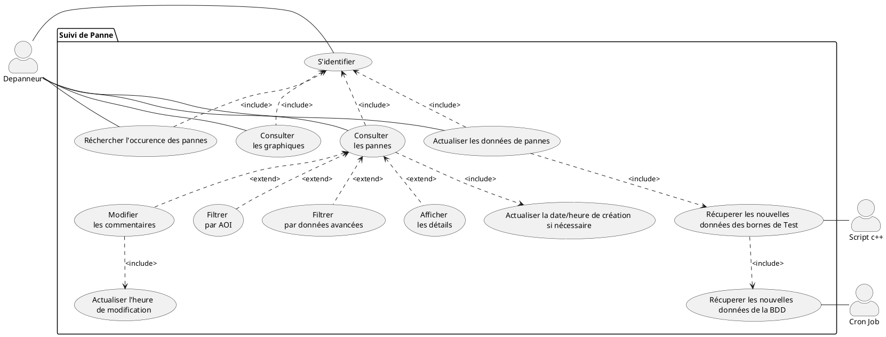
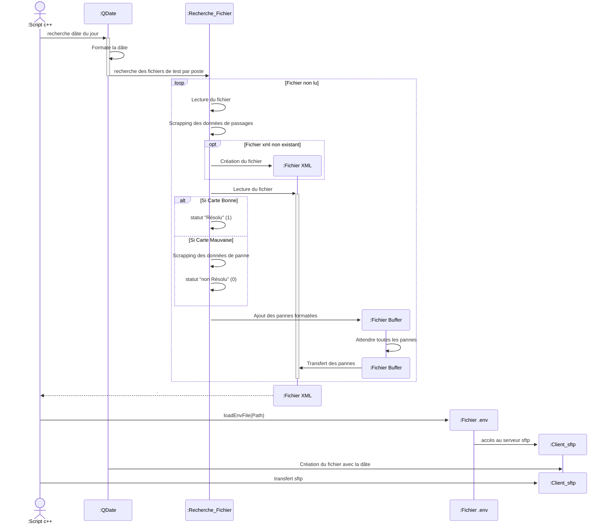
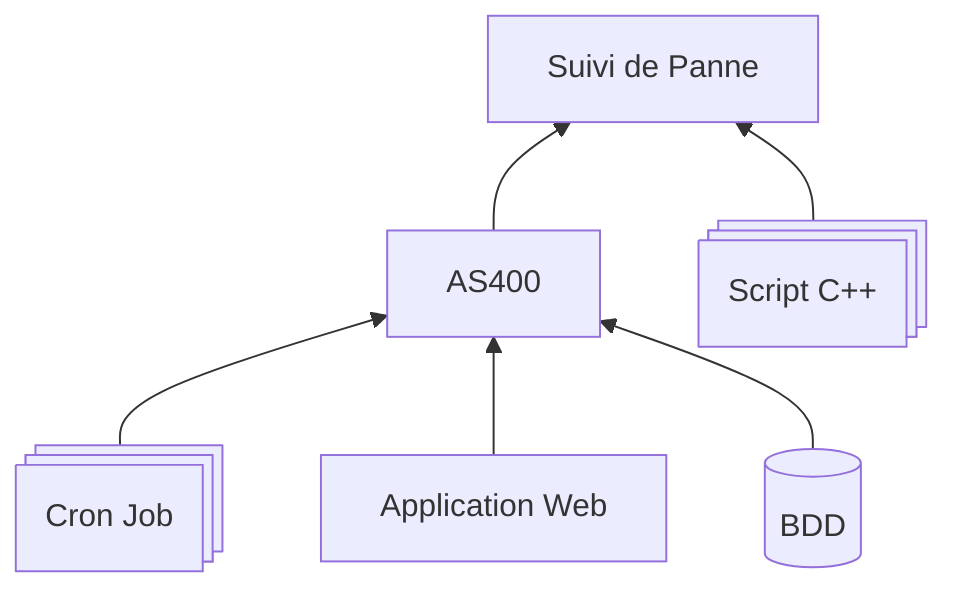

```plantuml
@startuml
skinparam actorStyle awesome
:Depanneur: as D
:Cron Job: as S2
:Script c++: as S1

package "Suivi de Panne" as p1{
    (S'identifier) as uc0
    (Consulter \nles pannes) as uc1
    (Consulter \nles graphiques) as uc2
    (Actualiser les données de pannes) as uc3
    (Réchercher l'occurence des pannes) as uc4
    
    (Filtrer \npar AOI) as uc11
    (Filtrer \npar données avancées) as uc12
    (Afficher \nles détails) as uc13
    (Modifier \nles commentaires) as uc14
    (Actualiser la date/heure de création\n si nécessaire) as uc15
    (Récuperer les nouvelles \ndonnées des bornes de Test) as uc31
    
    
    (Actualiser l'heure \nde modification) as uc141
    (Récuperer les nouvelles \ndonnées de la BDD) as uc311
    
}

D -[hidden]right- p1
D -right- uc0
D -right- uc1
D -right- uc2
D -right- uc3
D -right- uc4

uc0 -[hidden]up- uc1
uc0 -[hidden]- uc2
uc0 -[hidden]- uc3

uc1 .up.> uc0 : <include>
uc2 .up.> uc0 : <include>
uc3 .up.> uc0 : <include>
uc4 .up.> uc0 : <include>

uc11 .up.> uc1 : <extend>
uc12 .up.> uc1 : <extend>
uc13 .up.> uc1 : <extend>
uc14 .up.> uc1 : <extend>
uc15 <.up. uc1 : <include>

uc141 <.up. uc14 : <include>


S1 -left- uc31
S2 -left- uc311

uc3 .down.> uc31 : <include>
uc31 .down.> uc311 : <include>


@enduml
@enduml
```
^diagram-usecase

```mermaid
sequenceDiagram

    actor S as :Script c++

    participant c1 as :QDate

    participant c2 as :Recherche_Fichier

    S->>+c1: recherche dâte du jour

    c1->>c1:Formate la dâte

    c1->>-c2:recherche des fichiers de test par poste

    activate c2

  

    loop Fichier non lu

        c2->>c2:Lecture du fichier

        c2->>c2: Scrapping des données de passages

        opt Fichier xml non existant

            create participant x as :Fichier XML

            c2->>x:Création du fichier

        end

        c2->>+x:Lecture du fichier

  

        alt Si Carte Bonne

         c2->>c2:statut "Résolu" (1)

        else Si Carte Mauvaise

            c2->>c2:Scrapping des données de panne

            c2->>c2:statut "non Résolu" (0)

        end

  

        create participant x2 as :Fichier Buffer

        c2->>x2:Ajout des pannes formatées

  

        x2->>x2:Attendre toutes les pannes

        destroy x2

        x2->>x:Transfert des pannes

        deactivate x

    end

    destroy x

    x-->>S:.

    create participant c4 as :Fichier .env

    S->>c4: loadEnvFile(Path)

    create participant c3 as :Client_sftp

    c4->>c3: accès au serveur sftp

    c1->>c3: Création du fichier avec la dâte

    destroy c3

    S->>c3:transfert sftp
```
^diagram-sequence-scriptcpp

```mermaid
flowchart BT

    s1[Suivi de Panne]

    s2[AS400]

    s3@{ shape: procs, label: "Cron Job"}

    s4[Application Web]

    s5[(BDD)]

    s6@{ shape: procs, label: "Script C++"}

  

    s2 & s6 --> s1

    s3 & s4 & s5 --> s2
```
^diagram-class-general
